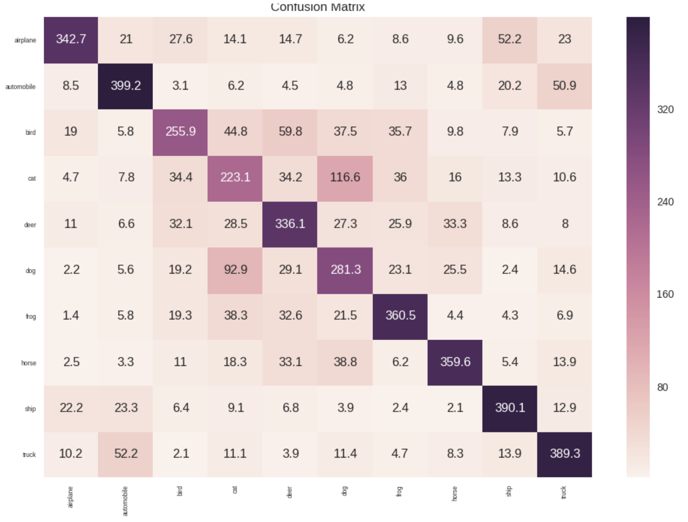
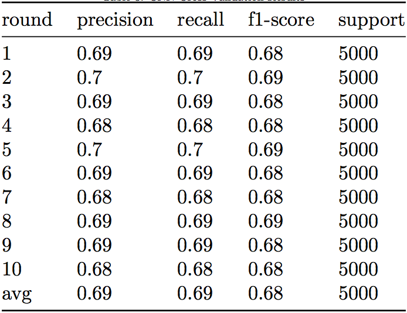

# CIFAR_10
### Table of Contents
* About
* Features
* Results
* Quick Start
* Changelog
### About
This is a tensorflow-backed image classifier with an accuracy of around 70% using CIFAR_10 dataset.
### Features
1. **Convolutional Neural Network**

    This classifier employs Convolutional Neural Network model to get higher accuracy.

2. **Tensorflow Backend**

    As the trainning stage involves huge amount of computation, tensorflow is used to make the most of GPU.

### Results

    
     

### Quick Start
    Prerequisites: 
        1. Python 3.6

    Installation:
        1. Clone or download the repository.
        2. Set up environment
           2.1 Change directory to the 'release' folder under the repo root.
           2.2 Install dependencies via command `pip install -r requirements.txt`.

    Run:
        1. Change directory to the 'release' folder under the repo root.
        4. Start application via command `python3 ./model/cnn.py`.
### Changelog
2018-06-15 &nbsp;&nbsp;&nbsp; Prototype 1.0 release